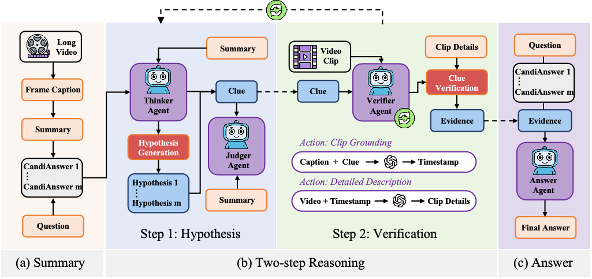
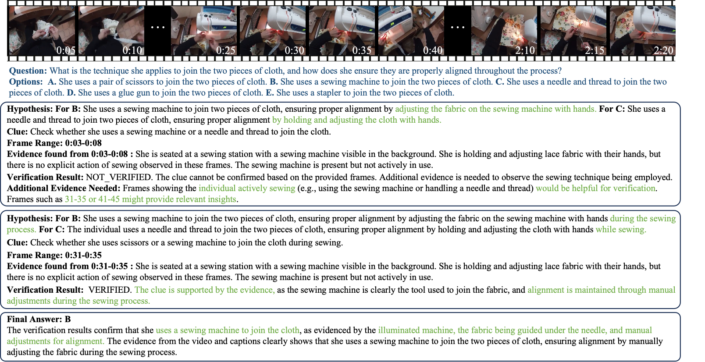

<div align="center">
  
# Think, Then Verify: A Hypothesis–Verification Multi-Agent Framework for Long Video Understanding (CVPR'2026)
  
[](https://cvpr.thecvf.com/Conferences/2026)
[](https://haorane.github.io/VideoHV-Agent/)
[](https://arxiv.org/abs/2603.04977)
[](https://github.com/Haorane/VideoHV-Agent)
</div>

The official implementation of **CVPR 2026** paper: [Think, Then Verify: A Hypothesis–Verification Multi-Agent Framework for Long Video Understanding](https://arxiv.org/abs/2603.04977).

> **TL;DR:** *We propose VideoHV-Agent, a multi-agent framework for long-form VideoQA built on a hypothesis–verification paradigm. Unlike prior single-agent or retrieval-based methods, it decomposes reasoning into explicit, verifiable steps executed by specialized agents.By testing structured hypotheses instead of aggregating noisy evidence, VideoHV-Agent filters spurious information, focuses on decision-relevant observations, and enables transparent agent coordination. This results in more robust, interpretable, and logically consistent video understanding.Experiments on EgoSchema, NextQA, and IntentQA show that VideoHV-Agent achieves state-of-the-art accuracy with strong efficiency and interpretability.*

## 📌 Citation
If you find this paper useful, please consider starring 🌟 this repo and citing 📑 our paper:
```bibtex
@misc{wang2026thinkverifyhypothesisverificationmultiagent,
      title={Think, Then Verify: A Hypothesis-Verification Multi-Agent Framework for Long Video Understanding}, 
      author={Zheng Wang and Haoran Chen and Haoxuan Qin and Zhipeng Wei and Tianwen Qian and Cong Bai},
      year={2026},
      eprint={2603.04977},
      archivePrefix={arXiv},
      primaryClass={cs.CV},
      url={https://arxiv.org/abs/2603.04977}, 
}
```

## 🌟 Overview

we propose **VideoHV-Agent**, a multi-agent framework that recasts long-video understanding as a **hypothesis–verification** process, thus achieving **thinking then verify** principle. By shifting from correlation-based retrieval to hypothesis–verification, VideoHV-Agent enables evidence-based, logically consistent, and interpretable reasoning for long-form VideoQA.VideoHV-Agent introduces a novel approach that:

- Hypothesis–Verification paradigm for long-form VideoQA
- Implements this paradigm as a multi-agent framework


<div align=center>

</div>


## 😍 Case Study

Qualitative study of event understanding in long videos. VideoHV-Agent uses hypothesis–verification to locate decisive evidence, highlighting its ability to avoid search purposefully and ground conclusions in explicit visual proof:

<div align=center>

</div>

## 🔄 Updates
* **[2026/04/16]**: Code released! 🎉
* **[2026/03/5]**: Initial version submitted to arXiv.
* **[2026/02/21]**: Our paper is accepted to CVPR 2026! 


## 📚 License

This repository is released under the [Apache License 2.0](LICENSE). This permissive license allows users to freely use, modify, distribute, and sublicense the code while maintaining copyright and license notices.

## ✨ Acknowledgement

We gratefully acknowledge all authors of VideoAgent-related work for their open-source code and meaningful contributions to the community.
